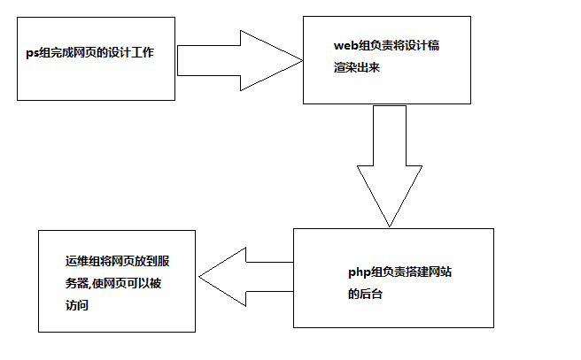

web组试用期前期准备
=================
### 前言 
&emsp;&emsp;首先欢迎大家进入试用期加入web组,可能很多人不太了解web组的主要工作,在这里我做一个简单的总结.web组可以说是在线比较重要的一个组,web组的主要工作就是把ps给的设计稿变成网页,让浏览器可以把页面的整体效果渲染出来.web是连接ps组合php组的重要桥梁,需要和ps以及php组的成员进行沟通. 
&emsp;&emsp;作为一名前端开发人员不知道~~全球最大的同性交友网站~~github实在说不过去,所以github是前端开发人员必须了解的网站.**没有之一**(~~至于github是什么就不用问我了吧,我相信大家都会百度搜索~~) 
&emsp;&emsp;下图表示了ps,web,php,运维组.四个组之间的关系.

<!-- 
 -->
### 试用期前期准备 
&emsp;&emsp;1.**前往[github官网](https://github.com/)注册一个github账号,并创建一个github仓库,将自己仓库的地址发到[这里](https://github.com/YUOL-CCY/-previous-preparation/issues).以后每一周都要将任务发布到自己创建的仓库里**.了解github是什么并熟悉github的基本使用(~~在以后的任务中,web组的成员需要把每一周的任务发布到github仓库~~),*git*有兴趣的可以了解**不做强制要求**.*github desktop*的安装以及使用.
**ps**:提交仓库地址的时候把自己的名字带上,要不然我不知道是谁.
 

&emsp;&emsp;2.*ps*的安装以及ps的基本使用,目前会切图就可以了,其他的暂时不做要求. 

&emsp;&emsp;3.编程软件的选择,以及安装.编程软件只是一个辅助工具.我不会做任何要求,选择一个适合自己的就可以了.我给的安装包是编程人员经常使用的前端编译器.如果大家认为不满意的话,可以自己去找其他的编程软件.**Dreamweaver**是一款强大的编译器,不过我现在没有破解版的,想用的可以自己想办法解决 ~~(**安装包的下载链接在底部**)~~. 

&emsp;&emsp;4.*markdown*文档每周任务必写.写文档是每个程序员必备的技能,养成写文档的好习惯对以后的发展有好处.

### 软件以及视频教程链接
- 1.[github desktop](https://pan.baidu.com/s/1LYhDsqpMQ9vt7uRM1veaWA)(**密码:c5ow**).
- 2.[ps软件](https://pan.baidu.com/s/12B2-A2dFddeXbdDnNW6H4g )(**密码:f6nq**).
- 3.[github教程](https://www.imooc.com/learn/390)看完前三章就可以了,后面的有兴趣可以继续了解.
- 4.[ps切图教程](https://www.imooc.com/learn/506),这一个小[demo](https://pan.baidu.com/s/1KkCqh4F91GM_dP3mDCuQpg)(**密码:ba4l**)可以练习切图.
- 5.[前端编译器](https://pan.baidu.com/s/1YugDxsMdokCrJa6up2mmgA ),(**密码:6yho**)
- 6.[markdown文档](http://xianbai.me/learn-md/article/about/readme.html)
- 7.[廖雪峰git教程](https://www.liaoxuefeng.com/wiki/0013739516305929606dd18361248578c67b8067c8c017b000) 

**PS:有一些资料是百度网盘分享的,要下载百度网盘获取资料**

