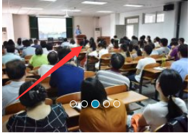

### 试用期第三周任务

#### 前言
&emsp;&emsp;经过前两周的学习,每个人都有不同程度的进步.在接下来的时间里,我们需要学习javascript.在学习过程中html以及css需要继续巩固.

#### 第三周任务
- 学习javascript.
 
- 完成以下 **任意一个** js特效
1. 下拉导航栏特效.
2. 图片轮播特效.
3. 弹窗特效.
4. 网页换肤特效.
5. 图片拖拽特效

### 第三周任务说明
1. 下拉导航特效要求. 
**参考:**[长江大学](http://www.yangtzeu.edu.cn/)官方网站导航栏特效

2. 图片轮播特效要求. 
**参考:**[长江大学临床医学院](http://yxb.yangtzeu.edu.cn/medical/yxrzztw/)图片轮播特效
 
轮播特效是每个人都必须会的,所以我建议你们选择这个.

3. 弹窗特效要求. 
**具体要求:** 弹窗的样式需要自己设计,页面中要有一个按钮,当点击按钮的时候弹窗显示.

4. 换肤特效要求. 
相信大家都接触过换肤.换肤特效的要求,页面要有一个按钮,点击换肤按钮的时候页面的背景需要做出相应的改变.

5. 图片拖拽特效要求. 
今天培训的时候我已经给大家展示过什么是拖拽了,只要可以实现我今天演示的效果就可以了. 

**ps:以上特效页面的设计需要你们自己完成** 

### 任务目的
1. 熟练掌握js的dom操作.
2. 熟悉javascript的常用语法.
3. 熟练掌握javascript事件的用法

### 视频资料
- [腾讯课堂js视频教程](https://ke.qq.com/course/231577)
- [廖雪峰javascript教程](https://www.liaoxuefeng.com/wiki/001434446689867b27157e896e74d51a89c25cc8b43bdb3000)
- [js特效案例](https://pan.baidu.com/s/13peQeGmwlzXnDD7D6xDeSw)**密码:1bic**

### 推荐书籍
- 《JavaScript 权威指南（第6版）》:能陪伴终生的一本Javascript宝典.~~从入到(放弃)精通.~~
- 《JavaScript DOM编程艺术 （第2版）》

